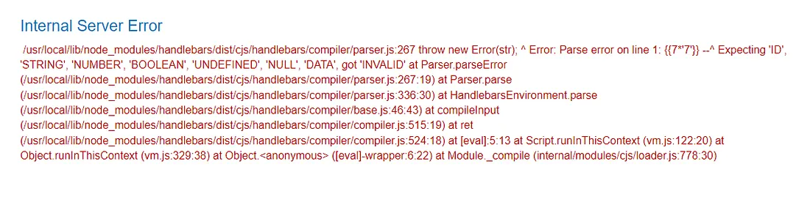
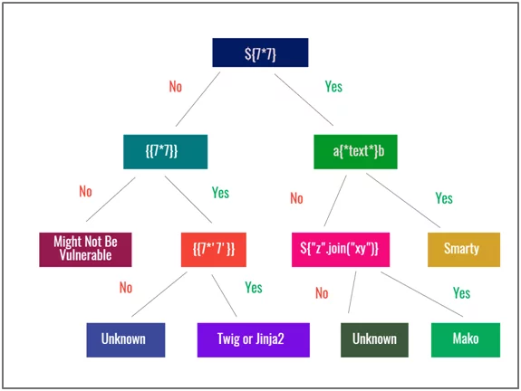

### Phần 2: Triển khai tấn công SSTI
Nối tiếp phần 1, bài này sẽ tiếp tục với ```SSTI```
## Các bước triển khai tấn công SSTI.
Dựa vào ```portswigger```, mình sẽ chia phần này thành 3 giai đoạn, __detect__(_Phát hiện_), __identify__(_Xác định_) và __exploit__(_Khai thác_).
<p align="center">
   
</p>

# Detect

<p align="left">
   
</p>

~~"_Tôi biết trang web đang bị __SSTI__ nhưng không thể chứng minh_"~~

Như bất kì lỗ hỏng nào khác, để khai thác được ```SSTI``` ta cần phát hiện ra nó. Phương pháp được dùng nhiều là ```fuzzing```. Với các dữ liệu từ người dùng như:
- Các trường trong __header__ của request( ví dụ: ```User-Agent```, ```Referer```,...).
- Tham số từ ```url request```( /?thamso1= ,...).
- Các trường dữ liệu được gửi qua form.
  
Ta thử thêm chuỗi các ký tự đặc biệt thường được sử dụng trong các biểu thức __template__, chẳng hạn như ```$ {{<%[%'"}}%```. Nếu xảy ra ```exception```, điều này cho thấy cú pháp __template__ được chèn vào đã được server diễn giải. Đây là một dấu hiệu cho thấy ```SSTI``` có thể tồn tại.

Nếu bạn đang làm 1 bài CTF whitebox thì mọi chuyện sẽ đơn giản hơn, khi đọc source code nếu phát hiện ```untrusted data``` được nối chuỗi trực tiếp vào __template__ thì đó chính xác là nơi mà chúng ta sẽ khai thác.

# Identify

Sau  khi xác định được web dính ```SSTI```, vẫn còn 1 bước cần làm trước khi khai thác là xác định xem trang web đang dùng ```template engine``` nào. Với các ngôn ngữ khác nhau lại có ```template engine``` khác nhau nên số lượng ```template engine``` khá lớn, và mỗi ```template engine``` lại có __syntax__ khác nhau nên ta cần xác định đúng ```template engine```, nhưng nhìn chung tụi nó lại khá tương đồng về mặt __syntax__.

Nếu may mắn, server được cấu hình debug, ta sẽ nhận được thông báo lỗi khi gửi payload ở bước ```detect``` và từ đó xác định được ngôn ngữ hay thậm chí là ```engine```. Ví dụ: 

<p align="center">
   
</p>

Qua thông báo lỗi, ta biết được ```engine``` đang được dùng là ```handlebars```.


Nếu không được nhả lỗi, ta có thể xác định ```engine``` bằng cách thủ công gửi thử payload với các syntax của các ```engine``` khác nhau, đánh giá phản hồi rồi loại trừ từng ```engine```.


<p align="center">
   
</p>

[___Nguồn ảnh ở đây___](https://www.varutra.com/server-side-template-injection-vulnerability-exploitation/)

<p align="center">
   
</p>

[___Nguồn ảnh ở đây___](https://book.hacktricks.wiki/en/pentesting-web/ssti-server-side-template-injection/index.html)

[___Xem thêm ở đây___](https://book.hacktricks.wiki/en/pentesting-web/ssti-server-side-template-injection/index.html))

tools
