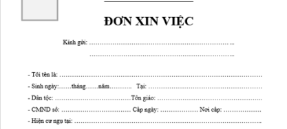
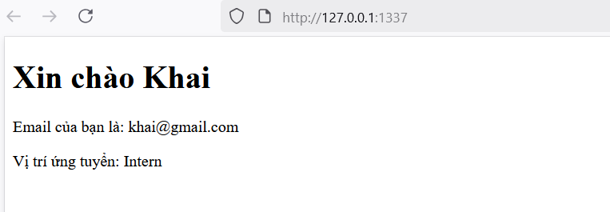
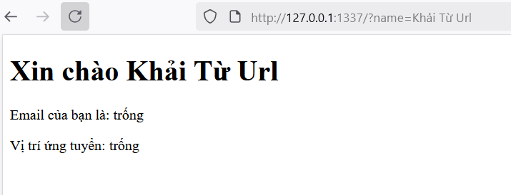
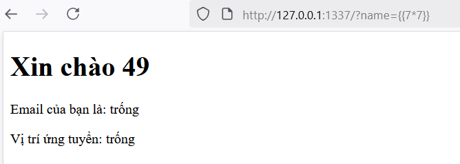
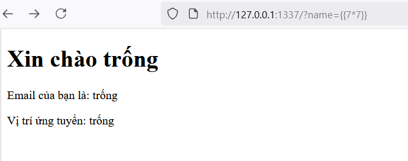

# SSTI-Server-Side-Template-Injection
## SSTI là gì?
Để hiểu được SSTI là gì, chúng ta cần biết ```template``` là gì? Mình sẽ giải thích qua một ví dụ:

Hãy giả sử bạn ứng tuyển vào một công ty và công ty đó có sẵn hàng loạt mẫu đơn tuyển dụng, ứng viên chỉ cần lấy và điền thông tin vào đơn. 

<p align="center">
  
</p>
Template giống như tờ đơn in sẵn: có khung, tiêu đề, chỗ điền; phần cố định do người soạn in sẵn, phần biến đổi là chỗ người dùng điền.

Trên web, **template** có thể là mã HTML, có các tiêu đề (mình sẽ gọi cái này là các yếu tố cố định trên template) và có ```placeholder``` (ví dụ bên dưới) để sau đó hệ thống điền dữ liệu để thay thế các placeholder này. 

```html
<!DOCTYPE html>
<html lang="vi">
<head>
  <meta charset="UTF-8">
  <title>Ví dụ Template</title>
</head>
<body>
  <h1>Xin chào {{ name }}</h1>
  <p>Email của bạn là: {{ email }}</p>
  <p>Vị trí ứng tuyển: {{ position }}</p>
</body>
</html>
```

Để hệ thống thay các placeholder trong template bằng dữ liệu thì cần có một thứ gọi là **Engine**. **Engine** này đóng vai trò tổng hợp các yếu tố cố định trên template với các dữ liệu được đưa vào tại thời điểm đó để render ra phiên bản web page tương ứng. Ở ngoài kia có rất nhiều **Template Engine** tùy thuộc vào ngôn ngữ mà web sử dụng ví dụ như ``` Jinja2 (Python), Twig (PHP), Velocity (Java) ```.

### Vậy SSTI là gì? 
Như cái tên của nó, đây là một lỗi ```Injection```, chúng ta sẽ tiêm payload độc hại và nó sẽ được xữ lý ở phía server và sau khi engine render template có thể sinh ra những kết quả không mong muốn. Trong đa số trường hợp xảy ra lỗ hổng **SSTI** đều mang lại các hậu quả to lớn cho server, bởi các payload SSTI được thực thi trực tiếp tại server và thường dẫn tới tấn công thực thi mã nguồn tùy ý từ xa ```(RCE - Remote Code Execution)```.

## Cụ thể **Server-Side Template Injection – SSTI** diễn ra như thế nào?
Như đã nói ở trên, **engine** sẽ lấy các dữ liệu liên quan điền vào ```placeholder``` rồi render ra web page tương ứng, nếu như các dữ liệu được dùng không phải do trực tiếp truyền vào thì việc khai thác **SSTI** là không thể. Như mã này:

```python
@app.route('/')
def hello_world():
   user = {'name':'Khai','email':'khai@gmail.com','position':'Intern'} # Xem đây là dữ liệu từ database
   name = user.get('name')
   email = user.get('email')
   position = user.get('position')
   template='''<!DOCTYPE html>
<html lang="vi">
<head>
  <meta charset="UTF-8">
  <title>Ví dụ Template</title>
</head>
<body>
  <h1>Xin chào '''+name+''' </h1>
  <p>Email của bạn là: '''+email+'''</p>
  <p>Vị trí ứng tuyển: '''+position+'''</p>
</body>
</html>''' 
   return render_template_string(template)
```

<p align="left">
  
</p>

Trong ví dụ này khi người dùng truy cập vào trang chủ, ứng dụng sẽ thực thi hàm ```hello_world()```. Vì dữ liệu được điền vào được lấy từ ```Database``` nên người khai thác không thể trực tiếp tiêm payload độc hại được, dẫn đến không thể khai thác ```SSTI``` _(Ứng dụng có validate khi thêm mới một user vào Database :)) )_.

Nhưng nếu lập trình viên dùng dữ liệu từ người dùng để tăng tính linh hoạt và tương tác của ứng dụng như lại quên ```validate``` dữ liệu được nhận thì nó lại là câu chuyện khác.

```python
@app.route('/')
def hello_world():
   name = request.args.get('name')
   email = request.args.get('email')
   position = request.args.get('position')
   if not email:
      email = "trống"
   if not position:
      position = "trống"
   template='''<!DOCTYPE html>
<html lang="vi">
<head>
  <meta charset="UTF-8">
  <title>Ví dụ Template</title>
</head>
<body>
  <h1>Xin chào '''+name+''' </h1>
  <p>Email của bạn là: '''+email+'''</p>
  <p>Vị trí ứng tuyển: '''+position+'''</p>
</body>
</html>''' 
   return render_template_string(template)
```

Trong trường hợp này dữ liệu được lấy từ các tham số qua Method **GET** do người dùng truyền vào.

<p align="left">
  
</p>

Xem qua code, ta thấy không có bất kì hàm nào dùng để ```validate``` cả 3 dữ liệu do người dùng truyền vào. Hãy thử một payload khác để kiểm tra.
<p align="left">
  
</p>

Thay vì in ra dữ liệu mà kẻ tấn công truyền vào, ứng dụng lại in ra 49, điều đó chứng tỏ ứng dụng có thể bị khai thác ```SSTI```. Bây giờ chỉ cần thay đổi payload là kẻ tấn công đã có thể __RCE__ rồi.

## Nhưng mà tại sao lại như vậy?

<p align="left">
  
</p>

Nguyên nhân thay vì in ra {{7*7}} thay vì 49 là do trong source code, ta có thể thấy tham số được nối chuỗi trực tiếp vào template.

```python
<h1>Xin chào '''+name+''' </h1>
```
Nếu name chứa __cú pháp template__ (ví dụ ```{{ ... }}``` hoặc ``````), thì sau khi ghép vào, chuỗi template trở thành một template do người dùng kiểm soát và Jinja2 sẽ cố gắng __thực thi biểu thức/template logic đó → đây chính là điều tạo ra SSTI.__

## Cách ngăn chặn

Vì **SSTI** cũng là một loại lỗ hổng về ``injection``, nên để ngăn chặn nó ta cần **validate** được gửi từ người dùng. Có thể dùng filter ~~đơn giản~~ để lọc ra cái kí tự không nên xuất hiện.

```python
name = request.args.get('name')
   email = request.args.get('email')
   position = request.args.get('position')
   if not name:
      name = "trống"
   if not email:
      email = "trống"
   if not position:
      position = "trống"
   simple_filter=["flag", "*", "\"", "'", "\\", "/", ";", ":", "~", "`", "+", "=", "&", "^", "%", "$", "#", "@", "!", "\n", "x", "import", "os", "request", "attr", "sys", "builtins", "class", "subclass", "config", "json", "sessions", "self", "templat", "view", "wrapper", "test", "log", "help", "cli", "blueprints", "signals", "typing", "ctx", "mro", "base", "url", "cycler", "get", "join", "name", "g.", "lipsum", "application", "render"]
   for char_num in range(len(simple_filter)):
      if simple_filter[char_num] in name.lower() or simple_filter[char_num] in email.lower() or simple_filter[char_num] in position.lower():
         name = "trống"
         email = "trống"
         position = "trống"
         break
```

<p align="left">
  
</p>


hoặc thay vì nối chuỗi, source code có thể viết như vậy:

```python

<body>
  <h1>Xin chào {{name}} </h1>
  <p>Email của bạn là: {{email}}</p>
  <p>Vị trí ứng tuyển: {{position}}</p>
</body>
</html>''' 
   return render_template_string(template, name=name, email=email, position=position)
```

Khi đó Jinja sẽ escape tham số nhận được, làm cho **atacker** không thể chèn được __cú pháp template__


